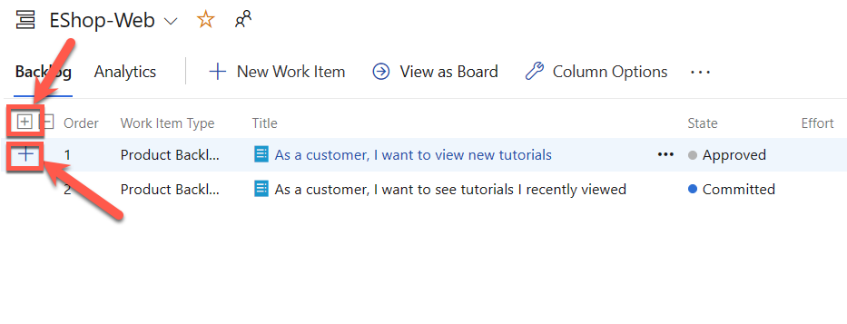

---
lab:
    title: 'Agile Planning and Portfolio Management with Azure Boards'
    module: 'Module 01: Get started on a DevOps transformation journey'
---

# Agile Planning and Portfolio Management with Azure Boards

# Student lab manual

## Lab requirements

- This lab requires **Microsoft Edge** or an [Azure DevOps supported browser.](https://docs.microsoft.com/en-us/azure/devops/server/compatibility?view=azure-devops#web-portal-supported-browsers)

- **Set up an Azure DevOps organization:** If you don't already have an Azure DevOps organization that you can use for this lab, create one by following the instructions available at [Create an organization or project collection](https://docs.microsoft.com/en-us/azure/devops/organizations/accounts/create-organization?view=azure-devops).

## Lab overview

ในแลปนี้ คุณจะได้ เรียนรู้เกี่ยวกับ วิธีการวางแผนและการจัดการพอร์ตโฟลิโอที่มีอยู่ใน Azure Boards เพื่อให้มันช่วยให้คุณ และทีของคุณวางแผน จัดการ และติดตามงานได้อย่างรวดเร็ว ทั้ง คุณจะได้เรียนรู้การใช้งาน product backlog, sprint backlog, และ task boards  ที่สามารถติดตามการดำเนินการกับหน้าที่งานในช่วงเวลาที่กำหนด และได้ลองใช้งานเคร่ื่องมือที่สามารถนำไปใช้งานกับทีมขนาดใหญ่ และองค์กรขนาดใหญ่ได้

## Objectives

ในแลปนี้คุณจะได้เรียนรู้วิธีการ:

- จัดการ teams, areas, iterations
- จัดการ work items
- จัดการ sprints และ capacity
- ปรับแต่ง Kanban boards
- กำหนด dashboards
- ปรับแต่ง team process

## Instructions

### Exercise 0: Configure the lab prerequisites

> **Note**: ถ้าคุณได้สร้าง project นี้ ในแลปก่อนหน้านี้ไว้แล้ว สามารถข้ามขั้นตอนนี้ได้เลยนะ

In this exercise, you will set up the prerequisites for the lab, which consist of a new Azure DevOps project with a repository based on the [eShopOnWeb](https://github.com/MicrosoftLearning/eShopOnWeb).

#### Task 1:  (skip if already done) Create and configure the team project

In this task, you will create an **eShopOnWeb** Azure DevOps project to be used by several labs.

1. On your lab computer, in a browser window open your Azure DevOps organization. Click on **New Project**. Give your project the name **eShopOnWeb**. Define **Private** as Visibility option.
2. Click **Advanced** and specify **Scrum** as **Work Item Process**.
 Click on **Create**.

    

### Exercise 1: Manage Agile project

ในแบบฝึกหัดนี้ คุณจะได้ใช้ Azure Boards เพื่อจัดการกับหลายๆ งานที่เกี่ยวข้องกับการวางแผนงาน Agile ทั่วๆ ไป ซึ่งรวมถึงการจัดการ teams, areas, iterations, work items, sprints และ capacity, การปรับแต่ง Kanban boards, การกำหนด dashboards, และการปรับแต่ง team process

#### Task 1: Manage teams, areas, and iterations

ในส่วนนี้ คุณจะสร้าง team ใหม่ และกำหนด area และ iterations ให้กับ team นี้

- ใน project ใหม่ จะมีการกำหนดค่าเริ่มต้นของ team ที่มีชื่อตรงกับชื่อของ project 
- คุณสามารถสร้าง team เพิ่มเติมได้ 
- แต่ละ team สามารถกำหนดสิทธิ์การเข้าถึง และกำหนดความสามารถใช้งาน Agile tools และ team assets ได้ 
- การสร้าง team เพิ่มเติม จะช่วยให้คุณสามารถเลือกใช้งานได้อย่างเหมาะสม ระหว่างการให้ความเป็นอิสระ และการทำงานร่วมกัน ในองค์กร

1. ให้ตรวจสอบว่า บนเว็บเบราว์เซอร์ มีการแสดงผลของ Azure DevOps organization และ project **EShopOnWeb** ที่คุณสร้างไว้ในแลปก่อนหน้านี้      

    > **หมายเหตุ**: หรือ คุณสามารถเข้าถึงหน้า project โดยตรง โดยใช้ URL [<https://dev.azure.com/>`<your-Azure-DevOps-account-name>`/EShopOnWeb) โดยที่ `<your-Azure-DevOps-account-name>` คือ ชื่อของ account ของคุณ


2. คลิกที่ไอคอนฟันเฟืองที่มีชื่อว่า **Project settings** ที่อยู่ด้านล่างขวาของหน้าจอ เพื่อเปิดหน้า **Project settings** จะแสดงรายละเอียดการตั้งค่าโปรเจคแบบรูปด้านล่าง

    


3. ในส่วน **General** ให้เลือกแท็บ **Teams** สังเกตว่า จะมีมีการกำหนด team ที่มีชื่อตรงกับชื่อของ project เป็นค่าเริ่มต้น แต่คุณจะสร้าง team ใหม่สำหรับแลปนี้ 

    3.1 คลิกที่ปุ่ม **New Team** ด้านขวาสุด

    


4. ในหน้าต่าง **Create a new team** ให้ใส่ชื่อ team ใหม่เป็น **EShop-Web** และคลิกที่ปุ่ม **Create** เพื่อสร้าง team ใหม่

    


5. ในรายการ **Teams** ให้คลิกเลือก team ที่คุณสร้างขึ้นมาใหม่ เพื่อดูรายละเอียดของ team นี้

    > **หมายเหตุ**: โดยค่าเริ่มต้น ใน team ใหม่ มีแค่คุณเท่านั้นที่เป็นสมาชิก คุณสามารถใช้หน้าต่างนี้ เพื่อจัดการกับสมาชิกใน team, การแจ้งเตือน และ dashboards ได้


6. คลิกที่ลิงค์ **Iterations and Area Paths** ที่อยู่ด้านบนของหน้า **EShop-Web** เพื่อเริ่มสร้าง กำหนดการ (Schedule) และขอบเขตของ team

    


7. ที่ด้านบนของหน้าต่าง **Boards** ให้เลือกแท็บ **Iterations** และคลิกที่ปุ่ม **+ Select iteration(s)**

    


8. เลือก **EShopOnWeb\Sprint 1** และคลิกที่ปุ่ม **Save and close**. สังเกตว่า สปริ้นท์แรกนี้จะปรากฏในรายการของ iterations แต่ยังไม่ได้กำหนดวันที่เริ่มต้นและสิ้นสุด

    


9. เลือก **Sprint 1** และคลิกที่**เครื่องหมาย 3 จุด (...)** จากนั้นเลือก **Edit**.

    

    > **หมายเหตุ**: กำหนดวันที่เริ่มต้นเป็นวันแรกของสัปดาห์ที่แล้ว และนับ 3 สัปดาห์เต็ม สำหรับแต่ละ sprint ตัวอย่างเช่น ถ้าวันที่ 6 มีนาคมเป็นวันแรกของสัปดาห์ สัปดาห์แรกจะเริ่มต้นในวันที่ 6 มีนาคม และจะสิ้นสุดในวันที่ 24 มีนาคม สัปดาห์ที่สองจะเริ่มต้นในวันที่ 27 มีนาคม ซึ่งเป็น 3 สัปดาห์หลังจากวันที่ 6 มีนาคม

10. ทำซ้ำขั้นตอนก่อนหน้านี้ เพื่อสร้าง **Sprint 2** และ **Sprint 3** โดยในที่นี้ให้สังเกตว่าวันที่ปัจจุบันของเรา อยู่ในสัปดาห์ที่ 2 ของ Sprint 2

    

11. ยังอยู่ในหน้าต่าง **Project Settings / Boards / Team Configuration** ที่ด้านบนของหน้าต่าง ให้เลือกแท็บ **Areas** คุณจะพบว่ามีการสร้าง area อัตโนมัติ ที่มีชื่อตรงกับชื่อของ team


12.  คลิกที่เครื่องหมาย 3 จุด (...) ที่อยู่ติดกับรายการ **default area** และในรายการแบบเลื่อนลง ให้เลือก **Include sub areas**.

    

    > **หมายเหตุ**: การตั้งค่าเริ่มต้นสำหรับทีมทั้งหมด คือ ไม่รวม sub-area paths แต่เราจะเปลี่ยนเป็นแบบ "รวม sub-areas" เพื่อให้ทีมได้เห็นงานทั้งหมดจากทีมอื่นๆ ในทางกลับกัน ที่ทางทีมระดับ management สามารถเลือกแบบ "ไม่รวม sub-areas" ซึ่งจะลบ work items ออกจากมุมมองของทีมที่เป็นเจ้าของงาน ทันทีที่มีการกำหนดให้กับทีมอื่นๆ

#### Task 2: Manage work items

ในแบบฝึกหัดนี้ คุณจะได้เรียนรู้การจัดการกับ work items สำคัญๆ ใน Azure DevOps ไม่ว่าจะเป็นการอธิบายงานที่ต้องทำ, สิ่งที่ขัดขวางในการ release งาน (Impediment to release), test definitions, หรือรายการอื่นๆ ที่สำคัญ 

โจทย์ตัวอย่างคือ

- คุณจะเน้นการใช้งาน work items ต่างๆ เพื่อวางแผนในการขยายส่วนของเว็บไซต์บริษัท Parts Unlimited ในส่วนของ Product Training Section 
- แม้ว่าจะเป็นงานที่ยากลำบากในการสร้างส่วนที่สำคัญของบริษัท แต่ Azure DevOps และ Scrum process ทำให้งานนี้เป็นไปได้อย่างง่ายดาย

> **Note**: ในแบบฝึกหัดนี้ จะแสดงให้เห็นถึงวิธีการสร้าง work items ต่างๆ และความสามารถที่มีอยู่ใน platform นี้ ซึ่งไม่ใช่เพื่อให้คุณนำไปใช้ในการจัดการ project ของคุณ แต่เป็นการแสดงถึงความยืดหยุ่นของ platform นี้ ซึ่งคุณสามารถสำรวจและทดลองใช้งานได้ตามที่คุณต้องการ

#### การสร้าง Work items: Epic 

1. ในแถบเมนูด้านซ้ายของ Azure DevOps portal, เลือกไอคอนเมนู **Boards** และเลือก **Work Items**

    > **หมายเหตุ**: มีหลายวิธีในการสร้าง work items ใน Azure DevOps และเราจะสำรวจวิธีการสร้างบางวิธี บางครั้งเพียงแค่สร้าง work items จาก dashboard มันก็ง่ายดี

2. ในหน้าต่าง **Boards > Work Items** คลิกที่ **+ New Work Item > Epic**.

    

3. ในช่อง **Enter title** ให้พิมพ์ **Product training**
4. ในมุมบนซ้ายของหน้าต่าง ให้เลือก **Unassigned** 
   - และในรายการแบบเลื่อนลง ให้ค้นหา และเลือก account ของคุณเอง เพื่อที่จะกำหนด work item ให้กับตัวเอง
5. ต่อไป ที่ **Area** 
   - ให้เลือก **eShopOnWeb** 
   - ในรายการ drop down menu ให้เลือก **EShop-WEB** ซึ่งจะกำหนด **Area** เป็น **eShopOnWeb\EShop-WEB**
6. ต่อไปในส่วน **Iteration** ให้เลือก **eShopOnWeb** 
   - และในรายการ drop down menu ให้เลือก **Sprint 2** ซึ่งจะกำหนด **Iteration** เป็น **eShopOnWeb\Sprint 2**

    

   
7. คลิกที่ปุ่ม **Save** เพื่อบันทึกการเปลี่ยนแปลง และ **อย่าปิดหน้าต่างนี้ นะ นะ นะ**

    

    > **หมายเหตุ**: ตามปกติ คุณควรจะต้องกรอกข้อมูลให้ครบทุกช่อง แต่ในแบบฝึกหัดนี้ ข้อมูลที่กรอกเพียงนี้ก็เพียงพอแล้ว สำหรับการทดลองใช้งาน

    > **หมายเหตุ**: หน้าต่างของ work item จะแสดงรายละเอียดที่เกี่ยวข้องกับ work item นั้นๆ ซึ่งรวมถึงรายละเอียดเกี่ยวกับผู้รับผิดชอบ, สถานะของงาน, และข้อมูลอื่นๆ ที่เกี่ยวข้องกับงานนั้นๆ ตัวหนึ่งในส่วนที่สำคัญคือ **Related Work** ซึ่งเป็นส่วนที่จะแสดงรายละเอียดเกี่ยวกับงานที่เกี่ยวข้อง ในส่วนนี้ เราจะสำรวจวิธีการเพ


#### การสร้าง Work items:  Feature ให้กับ Epic

8. ในส่วน **Related work** ที่อยู่ด้านล่างขวา (ล่าาางขวาาาาาสุด) ให้กดเลือก **Add link** และในรายการแบบเลื่อนลง ให้เลือก **New item**


9. ในหน้าต่าง **Add link** 
    - ให้เลือกรายการ **Link Type** เป็น **Child** 
    - และในรายการ **Work item type** ให้เลือก **Feature** 
    - ในช่อง **Title** ให้พิมพ์ **Training dashboard** และคลิกที่ปุ่ม **OK**

    


    > **Note**: หน้าต่าง **Training dashboard** จะแสดงรายละเอียดเกี่ยวกับ work item ที่เราสร้างขึ้นมาใหม่ ซึ่งรวมถึงการกำหนดผู้รับผิดชอบ, **Area**, และ **Iteration** ที่มีค่าเหมือนกับ work item ตัวต้นแบบที่เราสร้างขึ้นมา นอกจากนี้  work item ตัวต้นแบบ จะถูก link ไปยัง work item ลูกที่เราสร้างขึ้นมาใหม่


10. คลิกที่ปุ่ม **Add link** เพื่อบันทึกการเปลี่ยนแปลงของ Child Item และในหน้าต่าง **Training dashboard** คลิกที่ปุ่ม **Save & Close** เพื่อบันทึกการเปลี่ยนแปลง

    

11. ในแถบเมนูด้านซ้ายของ Azure DevOps portal, เลือกไอคอนเมนู **Boards** และเลือก **Boards**


12. ในแถบ **Boards** ให้เลือก **EShop-WEB boards** จะเป็นการเปิดหน้าต่าง **Boards** ของทีมนั้นๆ 

    


13. ในแถบ **Boards** ให้เลือก **Backlog items** และในรายการแบบเลื่อนลง ให้เลือก **Features**

    > **หมายเหตุ**: การเลือก **Features** จะทำให้ง่ายต่อการเพิ่ม task และ work items อื่นๆ ใน feature นั้นๆ

#### การสร้าง Work items: Product Backlog Item (PBI) ให้กับ Feature

14. ใช้เมาส์ชี้ไปที่สี่เหลี่ยมที่แสดง feature ของ **Training dashboard**  จะปรากฏเครื่องหมาย 3 จุด (...) ที่มุมบนขวาของสี่เหลี่ยมนั้น

15. คลิกที่เครื่องหมาย 3 จุด (...) และในรายการเมนูที่แสดงขึ้นมา ให้เลือก **Add Product Backlog Item**.

    


16. ในช่องข้อความของ product backlog item ใหม่ ให้พิมพ์ 
    ```
    As a customer, I want to view new tutorials
    ```
    และกดปุ่ม **Enter** เพื่อบันทึกการเปลี่ยนแปลง

    > **หมายเหตุ**: การกรอกข้อมูลนี้ จะสร้าง product backlog item (PBI) ใหม่ ซึ่งจะกลายเป็น child item ของ feature และมีการกำหนด **Area** และ **Iteration** เหมือนกับ feature ตัวหลัก


17. ทำซ้ำแบบเดียวกัน เพื่อสร้าง PBI อีก 2 รายการ โดยออกแบบให้ลูกค้าสามารถเห็นวิดีโอที่เคยดูไว้ และสามารถขอวิดีโอใหม่ได้ ตามลำดับ โดยให้ตั้งชื่อว่า 
    ```
    As a customer, I want to see tutorials I recently viewed
    ```
    และ 
    ```
    As a customer, I want to request new tutorials
    ```
    เสร็จแล้วได้จะได้รายการ PBI 3 ตัว ดังรูป

    

#### การจัดการ Backlog items ใน Kanban board

18. ในจากเมนูด้านขวาบน ของหน้า **Boards** ปัจจุบัน ให้เลือก **Features** และในรายการแบบเลื่อนลง ให้เลือก **Backlog items**.

    > **หมายเหตุ**: ในแบบฝึกหัดนี้ คุณสามารถเลือกใช้งานได้ทั้งการใช้งานแบบ form และการใช้งานแบบ drag and drop บน board แต่ในแบบฝึกหัดนี้ คุณจะใช้งานแบบ drag and drop บน board เพื่อความสะดวก


19. ในแท่บ **Board** ของ **EShop-WEB** ให้ลาก work item ตัวแรกที่ชื่อว่า **As a customer, I want to view new tutorials** จากสถานะ **New** ไปยังสถานะ **Approved**

    

    > **หมายเหตุ**: คุณสามารถขยาย work item card เพื่อแก้ไขรายละเอียดได้ง่ายๆ

20. ให้เลื่อนเมาส์ไปที่ work item ที่คุณย้ายไปที่สถานะ **Approved** จากนั้น ให้คลิกที่เครื่องหมายลูกศรที่ชี้ลง เพื่อแสดงรายละเอียดของ work item นั้นๆ

21. คลิกที่เครื่องหมายลูกศรที่ชี้ลง เพื่อแสดงรายละเอียดของ work item นั้นๆ 
    - จากนั้น ให้เลือกรายการ **Unassigned** 
    - ในรายการแบบเลื่อนลง ให้ค้นหา และเลือก account ของคุณเอง เพื่อที่จะกำหนด work item ให้กับตัวเอง

22. ในแท่บ **Board** ของ **EShop-WEB** ให้ลาก work item ตัวที่สองที่ชื่อว่า **As a customer, I want to see tutorials I recently viewed** จากสถานะ **New** ไปยังสถานะ **Committed**

23. ในแท่บ **Board** ของ **EShop-WEB** ให้ลาก work item ตัวที่สามที่ชื่อว่า **As a customer, I want to request new tutorials** จากสถานะ **New** ไปยังสถานะ **Done**

    

    > **หมายเหตุ**: หน้าต่างของ task board นี้ จะแสดงให้เห็นถึงงานที่ต้องทำ แต่คุณสามารถใช้งานแบบ tabular view ได้เช่นกัน


24. ในแท่บ **Board** ของ **EShop-WEB** ให้สังเกตด้่านบนซ้าย 
    - ให้คลิกที่ปุ่ม **View as Backlog** เพื่อแสดงในรูปแบบ tabular

    

    > **หมายเหตุ**: คุณสามารถใช้เครื่องหมายบวกที่อยู่ตรงกลางของแท่บ **Backlog** ของ **EShop-WEB** ในการแสดง task ที่อยู่ภายใต้ work item นั้นๆ

    > **หมายเหตุ**: คุณสามารถใช้เครื่องหมายบวกที่สอง ที่อยู่ด้านซ่้ายสุด Product Backlog Item ในการเพิ่ม task ใหม่ใน work item นั้นๆ


#### การสร้าง Task จาก PRoduct Backlog Item (PBI)

25. ในแท่บ **Backlog** ของ **EShop-WEB** ให้คลิกที่เครื่องหมายบวกที่สองที่อยู่ที่อยู่ด้านซ่้ายสุด Product Backlog Item ในการเพิ่ม task ใหม่ใน work item นั้นๆ จะปรากฏหน้าต่าง **NEW TASK** ขึ้นมา
    - ในที่นี้ให้กดเพิ่ม task ให้กับ work item ที่ชื่อว่า **As a customer, I want to view new tutorials**

    

26. ในช่อง **Enter title** ให้พิมพ์ **Add page for most recent tutorials**

27. จากหน้าต่าง **NEW TASK**
    - ในช่อง **Remaining Work** ให้พิมพ์ **5** 
    - ใน Activity dropdown list, ให้เลือก **Development**
    - คลิกที่ปุ่ม **Save & Close**

    

28. ทำซ้ำขั้นตอนที่ผ่านมาอีกครั้ง โดย
    - เพิ่ม task อีก 1 รายการ โดยตั้งชื่อว่า **Optimize data query for most recent tutorials** 
    - กำหนด **Remaining Work** เป็น **5** 
    - กำหนด **Activity** เป็น **Design** 
    - คลิกที่ปุ่ม **Save & Close** เพื่อบันทึกการเปลี่ยนแปลง

    

#### Task 3: Manage sprints and capacity

ในแบบฝึกหัดนี้ คุณจะได้เรียนรู้การจัดการกับงานใน sprint และการจัดการกับ capacity ของทีม ซึ่งเป็นส่วนสำคัญของการทำงานในแต่ละ sprint โดยทั่วไปแล้ว การวางแผน sprint จะเกิดขึ้นในวันแรกของ sprint แต่ในแบบฝึกหัดนี้ คุณจะได้เรียนรู้การวางแผน sprint ในวันที่ 2 ของ sprint และการจัดการกับ capacity ของทีม

##### Planing Meeting

- โดยทั่วไป planning meeting จะประกอบไปด้วย 2 ส่วน
- ส่วนแรกคือ team และ product owner จะช่วยกันในการระบุ backlog items ที่ team สามารถทำได้ใน sprint นั้นๆ โดยพิจารณาจากประสบการณ์ใน sprint ที่ผ่านมา และในส่วนนี้ backlog items ที่ได้จะถูกเพิ่มลงใน sprint backlog
- ส่วนที่สอง คือ team จะกำหนดวิธีการพัฒนาและทดสอบแต่ละ item และกำหนดและประเมิน task ที่จำเป็นต้องทำเพื่อให้สามารถทำงานในแต่ละ item ได้ ในที่สุด team จะกำหนดว่าจะทำงานกับ item ไหนบ้าง หรือทำงานกับทั้งหมด โดยพิจารณาจากการประเมินเวลาที่จำเป็นต้องใช้ในแต่ละ item

#### Daily Scrum และ Sprints
  
1. ในแถบเมนูด้านซ้ายของ Azure DevOps portal, เลือกไอคอนเมนู **Boards** และเลือก **Sprints**.


2. ในแท่บ **Taskboard** ของ **Sprints** 
   - ในแถบเมนูด้านขวาบน ให้เลือกไอคอนเมนู **View options** (อยู่ตรงกลางของไอคอน **Filter** และ **Refresh**) 
   - และในรายการแบบเลื่อนลง ให้เลือก **Work details** และเลือก **Sprint 2** เพื่อแสดงงานที่ต้องทำใน sprint นี้

    

    > **หมายเหตุ**: ใน sprint นี้ มีงานที่ต้องทำที่มีขอบเขตที่จำกัด 2 รายการ
    
    > ทั้งคู่อยู่ในสถานะ **To do** ในขณะนี้ ยังไม่มีการกำหนดผู้รับผิดชอบ
    
    > ทั้งคู่แสดงค่าตัวเลขทางด้านขวาของรายการ **Unassigned** ซึ่งแสดงถึงการประเมินเวลาที่เหลืออยู่


3. ในคอลัมน์ **ToDo** 
   - สังเกตว่ามี Task Item ที่ชื่อว่า **Add page for most recent tutorials**
   - ให้คลิกที่ **Unassigned** และในรายการของบัญชีผู้ใช้
   - และให้เลือกบัญชีของคุณเองเพื่อกำหนดงานให้กับตัวเอง


#### การใช้งาน Capacity ใน Sprint 

4. เลือกแท่บ **Capacity** ของ **Sprints**

    

    > **หมายเหตุ**: หน้าต่างนี้ จะแสดงให้เห็นถึงการกำหนดกิจกรรมที่ผู้ใช้งานสามารถทำได้ และระดับของ capacity ที่กำหนดไว้

5. ในแท่บ **Capacity** ของ **Sprints** 
   - ให้คลิกที่ **+Add User** และเลือกบัญชีของคุณเอง
   - ให้กำหนด **Activity** เป็น **Development** 
   - และในช่อง **Capacity per day** ให้พิมพ์ **1** ชั่วโมงต่อวัน

    > **หมายเหตุ**: ค่านี้ แสดงถึง 1 ชั่วโมงของงาน Development ต่อวัน สังเกตว่า คุณสามารถกำหนดกิจกรรมเพิ่มเติมให้กับผู้ใช้งานได้ ในกรณีที่พวกเขาทำงานอื่นๆ นอกเหนือจากงาน Development ในตัวอย่าง

    


#### การเพิ่มวันหยุดของคุณใน Sprint

สมมติว่าคุณมีแพลนจะลางานไปเที่ยวระหว่าง sprint นี้ ซึ่งควรจะเพิ่มเข้าไปใน capacity view ด้วย

6. ในแท่บ **Capacity** ของ **Sprints** 
   - ให้คลิกที่ **0 days** ในรายการของบัญชีผู้ใช้
   - จะเป็นการแสดงหน้าต่างในส่วนที่คุณสามารถกำหนดวันหยุดของคุณใน sprint นี้ได้

7. ในหน้าต่างที่แสดงขึ้นมา ให้ใช้การแสดงผลของปฏิทิน ในการกำหนดวันหยุดของคุณใน sprint นี้ โดยให้เลือกวันหยุดของคุณใน sprint นี้ ให้ครบ 4 วัน และเมื่อเสร็จแล้วให้คลิกที่ปุ่ม **OK**

    

8. ในแท่บ **Capacity** ของ **Sprints** ให้คลิกที่ปุ่ม **Save** เพื่อบันทึกการเปลี่ยนแปลง

9. ในแท่บ **Taskboard** ของ **Sprints** ให้สังเกตส่วนของ Work Detail
    - หากไม่มีให้กดปุ่ม View Options ด้านขวาบน และเลือก **Side Pane > Work Details**

    

    > **หมายเหตุ**: สังเกตว่า หน้าต่าง **Work details** ได้ถูกอัพเดทเพื่อแสดงผลของ capacity ที่คุณสามารถทำได้ จำนวนที่แสดงบนหน้าต่าง **Work details** อาจจะแตกต่างกันไป แต่จำนวนที่แสดงบนหน้าต่าง **Work details** จะเท่ากับจำนวนวันทำงานที่เหลืออยู่ใน sprint นี้ เนื่องจากคุณกำหนดให้ทำงาน 1 ชั่วโมงต่อวัน โดยให้สังเกตค่านี้ เนื่องจากคุณจะใช้ค่านี้ในขั้นตอนต่อไป

    > **หมายเหตุ**: คุณสามารถอัพเดทข้อมูลได้ง่ายๆ โดยการใช้งานแบบ in-line โดยเป็นการอัพเดทค่า **Remaining Work** ให้สอดคล้องกับเวลาที่คาดว่าจะใช้ในการทำงาน 


#### การจัดการกับงานที่เกิน capacity ของทีม

ในขั้นตอนต่อไป คุณจะต้องอัพเดทค่า **Remaining Work** ของ task ที่ชื่อว่า **Add page for most recent tutorials** เพิ่มขึ้น เพราะประเมินผิด

10. ในแท่บ **Taskboard** ของ **Sprints** 
    - ให้คลิกที่สี่เหลี่ยมที่แสดง **Add page for most recent tutorials** 
    - ในช่อง **Remaining Work** ให้พิมพ์ **14** 
    - และกดปุ่ม **Enter** เพื่อบันทึกการเปลี่ยนแปลง
    - ทำแบบเดียวกับ task ที่ชื่อว่า **Optimize data query for most recent tutorials** โดยให้กำหนด **Remaining Work** เป็น **3** ชั่วโมง

    

    แปลไทย

    > **หมายเหตุ**: การกำหนดค่านี้ จะทำให้ค่า **Development** และ **Capacity** ของคุณถูกกำหนดให้เป็นค่าสูงสุด โดยที่ค่านี้จะเพียงพอกับงานที่ได้รับมอบหมาย แต่ค่า **Team** จะเกินกว่าค่าที่กำหนดไว้ เนื่องจากมีการกำหนดเวลาเพิ่มเติม 3 ชั่วโมง ใน task ที่ชื่อว่า **Optimize data query for most recent tutorials**


    > แนวทางการแก้ไขปัญหานี้ คือ คุณสามารถย้าย task ไปยัง sprint ถัดไปได้ โดยการเปิด task นั้นๆ และแก้ไขข้อมูลในหน้าต่างที่แสดงขึ้นมา หรือใช้งานแบบ in-line ในหน้าต่าง **Backlog** โดยการเลือก **Move to iteration** แต่ในขั้นตอนนี้ คุณไม่ต้องย้าย task นี้ไปยัง sprint ถัดไป

11. ในแท่บ **Taskboard** ของ **Sprints**
    - จากด้านขวามือของหน้าจอ
    - คลิกเลือกปุ่มไอคอน View Options และเลือก **Assigned To=** ในรายการแบบเลื่อนลง

    > **หมายเหตุ**: การกำหนดค่านี้ จะทำให้คุณสามารถตรวจสอบความคืบหน้าของ task โดยแยกตามบุคคล แทนที่จะแยกตาม backlog item

    > **หมายเหตุ**: ยังมีการปรับแต่งอีกหลายแบบนะ

#### การใช้ styles rule ในการแสดงผลของ task 

12.   คลิกปุ่มไอคอนฟันเฟืองที่ชื่อ **Configure team settings** (อยู่ทางขวาของ funnel icon)


13. ในหน้าต่าง **Setting** 
    - ให้เลือกแท่บ **Styles**
    - คลิกที่ปุ่ม **+ Styling rule** 
    - ในส่วนของ **Rule name** ให้พิมพ์ **Development** 
    - ในรายการแบบเลื่อนลง ให้เลือกสี่เหลี่ยมสีเขียว

    > **หมายเหตุ**: การกำหนดค่านี้ จะทำให้ทุกๆ task ที่มีการกำหนด **Activity** เป็น **Development** จะถูกกำหนดสีเป็นสีเขียว


14. ในส่วนของ **Rule criteria**
    - ในรายการของ **Field** ให้เลือก **Activity**
    - ในรายการของ **Operator** ให้เลือก **=**
    - และในรายการของ **Value** ให้เลือก **Development**.

     


16. ยังอยู่ในหน้าต่าง **Settings** ให้เลือกแท่บ **Backlogs**

    > **หมายเหตุ**: คุณสามารถตั้งค่าระดับที่สามารถใช้ใน Navigation ได้ โดยค่าเริ่มต้นจะไม่รวม Epics แต่คุณสามารถเปลี่ยนค่านี้ได้

17. ยังอยู่ในหน้าต่าง **Settings** ให้เลือกแท่บ **Working days**

    > **หมายเหตุ**: การกำหนดค่า **Working days** นี้ จะทำให้คุณสามารถกำหนดวันทำงานของทีมได้ ซึ่งจะมีผลกับการคำนวณ capacity และ burndown

18.  ยังอยู่ในหน้าต่าง **Settings** ให้เลือกแท่บ **Working with bugs**

        > **หมายเหตุ**: การกำหนดค่า **Working with bugs** นี้ จะทำให้คุณสามารถกำหนดว่า bug จะถูกแสดงอย่างไรบน board

19. ในหน้าต่าง **Settings** ให้คลิกที่ปุ่ม **Save and close** เพื่อบันทึกการเปลี่ยนแปลง

    > **หมายเหตุ**: ตอนนี้ task ที่มีการกำหนด **Activity** เป็น **Development** จะถูกกำหนดสีเป็นสีเขียว ซึ่งจะทำให้ง่ายต่อการตรวจสอบความคืบหน้าของงาน

    


#### Task 4: Customize Kanban boards


ในแบบฝึกหัดนี้ คุณจะได้เรียนรู้การปรับแต่ง Kanban boards

- เพื่อให้ทีมสามารถส่งมอบซอฟต์แวร์ที่มีคุณภาพสูงได้อย่างสม่ำเสมอ การใช้ Kanban จึงเน้นไปที่ 2 แนวทางหลัก ๆ คือ 
    1. การแสดงผลของการทำงาน ซึ่งจำเป็นต้องมีการกำหนด workflow stages และการกำหนดค่า Kanban board ให้ตรงกับ workflow stages นั้น 
    2. การจำกัดจำนวนงานที่กำลังดำเนินการ ซึ่งจำเป็นต้องกำหนด work-in-progress (WIP) limits 

- จากนั้นคุณก็พร้อมที่จะติดตามความคืบหน้าบน Kanban board และตรวจสอบ metrics ที่สำคัญเพื่อลด cycle time 
- ด้วย Kanban board คุณสามารถแปลง backlog ของคุณให้เป็น interactive signboard ที่มีการแสดงผลของการทำงาน ซึ่งจะแสดงผลเป็นการแสดงผลของงาน แต่ละคอลัมน์จะแสดงถึง workflow stages และแต่ละการ์ดจะแสดงถึง user story (blue cards) หรือ bug (red cards) ใน workflow stages นั้น ๆ 
- ทุกทีมสามารถปรับแต่ง process ของตนเองได้

#### การกำหนดสีให้ tag

1. ในแถบเมนูด้านซ้ายของ Azure DevOps portal, เลือกไอคอนเมนู **Boards** และเลือก **Boards**.

2. ในหน้าต่าง **Board** ให้คลิกที่ไอคอนฟันเฟืองที่ชื่อ **Configure board settings** (อยู่ทางขวาของ funnel icon)

    > **หมายเหตุ**: ในสถานการณ์นี้ ทีมของคุณกำลังให้ความสำคัญกับงานที่เกี่ยวข้องกับ data  ดังนั้นจึงมีการกำหนดค่าเพิ่มเติมเพื่อให้งานที่เกี่ยวข้องกับการเข้าถึงหรือการจัดเก็บข้อมูล สามารถแสดงผลได้อย่างชัดเจน

3. ในหน้าต่าง **Settings** 
   - ให้เลือกแท่บ **Tag colors** 
   - คลิกที่ปุ่ม **+ Tag color** 
   - ในช่อง **Tag** ให้พิมพ์ **data** 
   - และในส่วนของ **Color** ให้เลือกสีที่เป็นค่าเริ่มต้น หรือสีที่ต้องการ
  
        


        > **หมายเหตุ**: ในกรณีที่มีการกำหนด tag ให้กับ backlog item หรือ bug ที่มีการกำหนด tag เป็น **data** จะถูกเน้นสีเหลือง

4. จากหน้าต่าง **Configure board settings** (cogwheel) ในแท่บ **Settings** ให้เลือกแท่บ **Annotations**

    > **หมายเหตุ**: คุณสามารถกำหนดว่าจะแสดง **Annotations** ใดบนการ์ด ซึ่งจะทำให้ง่ายต่อการอ่าน และค้นหา 
    
    > โดยการกำหนดค่า annotation ที่เปิดใช้งาน การ์ดจะแสดงข้อมูลของ child work item ที่เกี่ยวข้อง โดยการคลิกที่การ์ด


5. ในหน้าต่าง **Settings** ให้เลือกแท่บ **Tests**
   
   > **หมายเหตุ**: แท่บนี้ จะทำให้คุณสามารถกำหนดว่าจะแสดง **Tests** ใดบนการ์ด ซึ่งจะทำให้ง่ายต่อการอ่าน และค้นหา

6. ในหน้าต่าง **Settings** ให้คลิกที่ปุ่ม **Save and close** เพื่อบันทึกการเปลี่ยนแปลง
7. ในแท่บ **Board** ของ **EShop-WEB** 
   - ให้เปิด Work Item (backlog item) ที่ชื่อว่า **As a customer, I want to view new tutorials**

8. จากรายละเอียดของ item 
   - สังเกตบริเวณด้านบนทางขวา 
   - ให้คลิกที่ปุ่ม **Add tag** ที่อยู่ด้านขวาของ **0 comments**

9. ในช่องข้อความที่แสดงขึ้นมา ให้พิมพ์ **data** และกดปุ่ม **Enter**
10. ทำซ้ำขั้นตอนก่อนหน้า เพื่อเพิ่ม tag ที่ชื่อว่า **ux**
11. บันทึกการเปลี่ยนแปลงโดยการคลิกที่ปุ่ม **Save & Close**
    
    
    > **หมายเหตุ**: สอง tag ที่เพิ่มเข้ามา จะแสดงบนการ์ด โดยที่ tag **data** จะถูกเน้นสีเหลือง และ tag **ux** จะถูกเน้นสีฟ้า

#### การสร้าง workflow stages ใหม่ และการกำหนดค่า WIP limits

12. จากหน้าต่าง Boards ให้คลิกที่ไอคอนฟันเฟืองที่ชื่อ **Configure board settings** (อยู่ทางขวาของ funnel icon)
13. ในหน้าต่าง **Settings** ให้เลือกแท่บ **Columns**
    > **หมายเหตุ**: ในส่วนนี้จะทำให้เราสามารถเพิ่ม workflow stages ได้
14. คลิกที่ปุ่ม **+ Column** 
    - ในส่วนของ **Column name** 
    - ให้พิมพ์ 
        ```
        QA Approved
        ``` 
    - และในส่วนของ **WIP limit** ให้พิมพ์ **1**
  
    

    > **หมายเหตุ**: ค่า **Work in progress limit** ที่เป็น 1 จะแสดงถึงว่า ใน stage นี้ จะมี work item อยู่ได้เพียง 1 อันเท่านั้น ซึ่งในปกติ ค่านี้จะถูกกำหนดให้สูงกว่านี้ แต่ในที่นี้ จะใช้เพื่อแสดงตัวอย่างเท่านั้น

15.  ในหน้าต่าง **Settings** ให้เลือกแท่บ **Columns** อีกครั้ง
    - ให้สังเกตว่ามีไอคอน (...) ที่อยู่ด้านขวาของคอลัมน์ **QA Approved** ที่คุณสร้างขึ้น
    - ให้คลิกไอคอน (...) และเลือก **Move right** 2 ครั้ง จนกว่าคอลัมน์ **QA Approved** จะถูกเลื่อนไปอยู่ระหว่าง **Committed** และ **Done**
16. ในหน้าต่าง **Settings** ให้คลิกที่ปุ่ม **Save** เพื่อบันทึกการเปลี่ยนแปลง
17. ในหน้าต่าง **Boards** ให้คลิกที่ปุ่ม **Refresh** เพื่อให้คอลัมน์ **QA Approved** แสดงผลบน Kanban board
18. ในหน้าต่าง **Boards** ให้ลาก work item ที่ชื่อว่า **As a customer, I want to see tutorials I recently viewed** จากคอลัมน์ **Committed** ไปยังคอลัมน์ **QA Approved**

19. ในหน้าต่าง **Boards** ให้ลาก work item ที่ชื่อว่า **As a customer, I want to view new tutorials** จากคอลัมน์ **Approved** ไปยังคอลัมน์ **QA Approved**

    

    > **หมายเหตุ**: คอลัมน์ **QA Approved** จะถูกเน้นสีแดง และแสดงข้อความเตือนว่า ค่า **WIP** ของคอลัมน์นี้ ถูกเกินกว่าที่กำหนดไว้


20. ในหน้าต่าง **Boards** ให้ลาก work item ที่ชื่อว่า **As a customer, I want to see tutorials I recently viewed** กลับไปยังคอลัมน์ **Committed**

##### การแบ่งคอลัมน์ออกเป็น doing และ done เพื่อลดความสับสน

มักเกิดความสับสนบ่อยๆ ระหว่างสถานะของ work item ที่อยู่ใน column ว่ามันแค่ถูกลากมาไว้ หรือมันกำหลังถูกดำเนินการอยู่ 
    
ดังนั้น คุณสามารถกำหนดค่า **Split column into doing and done** ได้ ซึ่งจะทำให้แต่ละคอลัมน์ จะถูกแบ่งออกเป็น 2 ส่วน คือ **Doing** และ **Done** ซึ่งจะทำให้ง่ายต่อการตรวจสอบความคืบหน้าของงาน โดยที่แต่ละคอลัมน์จะแสดงถึงสถานะของงานที่กำลังดำเนินการอยู่ และสถานะของงานที่เสร็จสิ้นแล้ว

21. ในหน้าต่าง **Boards** ให้คลิกที่ไอคอนฟันเฟืองที่ชื่อ **Configure board settings** (อยู่ทางขวาของ funnel icon)
22. ในหน้าต่าง **Settings** ให้เลือกแท่บ **Columns** และเลือกแท่บ **QA Approved**
23. ในแท่บ **QA Approved** ให้เลือก **Split column into doing and done** เพื่อสร้างคอลัมน์ 2 คอลัมน์

    > **หมายเหตุ**: เมื่อทีมของคุณอัพเดทสถานะของงาน จากการทำงานใน stage นึง ไปยัง stage ถัดไป คุณควรกำหนดค่า **Definition of done** ให้กับแต่ละคอลัมน์ ซึ่งจะช่วยให้ทุกคนในทีม สามารถเข้าใจได้ว่า งานที่อยู่ใน stage นี้ จะถูกกำหนดให้เสร็จสิ้นเมื่อเข้าเงื่อนไขไหน

24. ในแท่บ **QA Approved** ในส่วนของ **Definition of done** ให้พิมพ์ 
    ```
    Passes \*\*all\*\* tests**.
    ```
25. ในหน้าต่าง **Settings** ให้คลิกที่ปุ่ม **Save and close** เพื่อบันทึกการเปลี่ยนแปลง

    

    > **หมายเหตุ**: ตอนนี้ คอลัมน์ **QA Approved** จะถูกแบ่งออกเป็น 2 คอลัมน์ คือ **Doing** และ **Done** ซึ่งจะทำให้ง่ายต่อการตรวจสอบความคืบหน้าของงาน โดยที่แต่ละคอลัมน์จะแสดงถึงสถานะของงานที่กำลังดำเนินการอยู่ และสถานะของงานที่เสร็จสิ้นแล้ว


##### การสร้าง Swimlanes

Kanban board ของเรา สามารถแสดงผลของการทำงานได้ โดยการแสดงผลของงานที่อยู่ในสถานะต่าง ๆ ตั้งแต่เริ่มต้น จนถึงเสร็จสิ้น และเมื่อคุณเพิ่ม **swimlanes** คุณสามารถแสดงผลของงานที่อยู่ในสถานะต่าง ๆ ที่มีการกำหนดความสำคัญ โดยคุณสามารถสร้าง swimlane ที่แสดงถึงสถานะของงานที่อยู่ในสถานะต่าง ๆ ได้

26.  ในหน้าต่าง **Boards** ให้คลิกที่ไอคอนฟันเฟืองที่ชื่อ **Configure boards settings** (อยู่ทางขวาของ funnel icon)
27.  ในหน้าต่าง **Settings** ให้เลือกแท่บ **Swimlanes**
28.  ในแท่บ **Swimlanes** 
    - ให้คลิกที่ปุ่ม **+ Swimlane** ที่อยู่ใต้ **Swimlane name** 
    - ในช่องข้อความ **Name** ให้พิมพ์ **Expedite**
29.  ในหน้าต่าง **Settings** ให้คลิกที่ปุ่ม **Save** เพื่อบันทึกการเปลี่ยนแปลง

    

30.  ในหน้าต่าง **Boards** ให้ลาก work item ที่ชื่อว่า **Committed** ไปยังคอลัมน์ **QA Approved \| Doing** ของ swimlane **Expedite** เพื่อแสดงถึงความสำคัญของงานนี้ โดยงานนี้จะถูกดำเนินการเมื่อทีม QA มีเวลาว่าง


#### Task 5: Customize team process

In this task we'll create a custom Scrum-based process. The process will include a backlog item field designed to track to a proprietary eShopOnWeb ticket ID.

In Azure DevOps, you customize your work tracking experience through a process. A process defines the building blocks of the work item tracking system as well as other sub-systems you access through Azure DevOps. Whenever you create a team project, you select the process which contains the building blocks you want for your project. Azure DevOps supports two process types. The first, the core system processes (Scrum, Agile, and CMMI) are read-only, so you cannot customize them. The second type, inherited processes, you create based on core system processes, with the option of customizing their settings.

All processes are shared within the same organization. That is, one or more team projects can reference a single process. Instead of customizing a single team project, you customize a process. Changes made to the process automatically update all team projects that reference that process. Once you've created an inherited process, you can customize it, create team projects based on it, and migrate existing team projects to reference it. The Git team project can't be customized until it's migrated to an inherited process.

1. On the Azure DevOps page, click the **Azure DevOps** logo in the top left corner to navigate to the account root page.
2. In the left bottom corner of the page, click **Organization settings**.
3. In the **Organization Settings** vertical menu, in the **Boards** section, select **Process**.
4. On the **All processes** pane, to the right of the **Scrum** entry, select the ellipsis symbol (...) and, in the dropdown menu, select **Create inherited process**.

    

5. In the **Create inherited process from Scrum** panel, in the **Process name (required)** textbox, type **Customized Scrum** and click **Create process**.
6. Back on the **All processes** pane, click the **Customized Scrum** entry.

    > **Note**: You may need to refresh the browser for the new process to become visible.

7. On the **All processes > Customized Scrum** pane, select **Product Backlog Item**.

    

8. On the **All processes > Customized Scrum > Product Backlog Item** pane, click **New field**.
9. On the **Add a field to Product Backlog Item** panel, on the **Definition** tab, in the **Create a field** section, in the **Name** textbox, type **EShop Ticket ID**.

    

10. On the **Add a field to Product Backlog Item** panel, click **Layout**.
11. On the **Add a field to Product Backlog Item** panel, on the **Layout** tab, in the **Label** textbox, type **Ticket ID**, select the **Create a new group** option, in the **Group** textbox, type **EShopOnWeb**, and click **Add field**.

    

    > **Note**: Now that the customized process has been configured, let's switch to the eShopOnWeb project to use it.

12. Return to the **All processes** root using the breadcrumb path at the top of the **All processes > Customized Scrum > Product Backlog Item** pane.
13. On the **All processes** pane, select the **Scrum** entry.

    

    > **Note**: Our current project uses **Scrum**.

14. On the **All processes > Scrum** pane, select the **Projects** tab.
15. In the list of projects, in the row containing the **eShopOnWeb** entry, select the ellipsis symbol (...) and then select **Change process**.
16. On the **Change the project process** pane, in the **Select a target process** dropdown list, select the **Customized Scrum** process, click **Save** and then click **Close**.

    

17. Click the **Azure DevOps** logo in the top left corner to return to the account root page.
18. On the **Projects** tab, select the entry representing the **eShopOnWeb** project.
19. In the vertical menu on the left side of the **eShopOnWeb** page, select **Boards** and ensure that the **Work Items** pane is displayed.
20. In the list of work items, click the first backlog item.
21. Verify that you now have the **Ticket ID** field under the **eShopOnWeb** group, which was defined during the process customization. You can treat this like any other text field.

    

    > **Note**: Once the work item is saved, Azure DevOps will also save the new custom information so that it will be available for queries and through the rest of Azure DevOps.

### Exercise 2 (optional) : การกำหนด dashboards

In this task, you will step through the process of creating dashboards and their core components.

Dashboards allow teams to visualize status and monitor progress across the project. At a glance, you can make informed decisions without having to drill down into other parts of your team project site. The Overview page provides access to a default team dashboard which you can customize by adding, removing, or rearranging the tiles. Each tile corresponds to a widget that provides access to one or more features or functions.

แปลไทย

1. In the vertical navigational pane of the Azure DevOps portal, select the **Overview** icon and, in the list of the **Overview** items, select **Dashboards**.
2. If necessary, on the **Dashboards** pane, in the upper left corner, in the **eShopOnWeb Team** section, select **eShopOnWeb Team - Overview** and review the existing dashboard.

    

3. On the **Dashboards** pane, select the drop-down menu next to the **eShopOnWeb Team - Overview** title, and select **+ New dashboard**.

    

4. On the **Create a dashboard** pane, in the **Name** textbox, type **Product training**, in the **Team** dropdown list, select the **EShop-WEB** team, and click **Create**.

    

5. On the new dashboard pane, click **Add a widget**.
6. On the **Add Widget** panel, in the **Search** textbox, type **sprint** to find existing widgets that focus on sprints. In the list of results, select **Sprint Overview** and click **Add**.
7. In the rectangle representing the newly added widget, click the **Settings** cogwheel icon and review the **Configuration** pane.

    > **Note**: The customization level will vary by widget.

8. On the **Configuration** pane, click **Close** without making any changes.
9. Back on the **Add Widget** pane, in the **Search** textbox, type **sprint** again to find existing widgets that focus on sprints. In the list of results, select **Sprint Capacity** and click **Add**.
10. In the **Dashboard** view, at the top of the pane, click **Done Editing**.

    

    > **Note**: You can now review two important aspects of your current sprint on your custom dashboard.

    > **Note**: Another way of customizing dashboards is to generate charts based on work item queries, which you can share to a dashboard.

11. In the vertical navigational pane of the Azure DevOps portal, select the **Boards** icon and, in the list of the **Boards** items, select **Queries**.
12. On the **Queries** pane, click **+ New query**.
13. On the **Editor** tab of **Queries > My Queries** pane, in the **Value** dropdown list of the **Work Item Type** row, select **Task**.
14. On the **Editor** tab of **Queries > My Queries** pane, in the second row, in the **Field** column, select **Area Path** and, in the corresponding **Value** dropdown list, select **eShopOnWeb\\EShop-WEB**.
15. Click **Save query**.

    

16. In the **New query** panel, in the **Enter name** textbox, type **Web tasks**, in the **Folder** dropdown list, select **Shared Queries**, and click **OK**.
17. From the **Queries>Shared Queries** view, select the **Charts** tab and click **+ New chart**.
18. On the **Configure Chart** panel, in the **Name** textbox, type **Web tasks - By assignment**, in the **Group by** dropdown list, select **Assigned To**, and click **Save Chart** to save the changes.

    

    > **Note**: You can now add this chart to a dashboard.

19. Return to the **Dashboards** section in the **Overview** Menu. From the **EShop-Web** section, select the **Product Training** dashboard you used earlier, to open it. 

20. Click **Edit** from the top menu. From the **Add Widget** list, search for **Chart** , and select **Chart for Work Items**. Click **Add** to add this widget to the EShop-Web dashboard. 

21. Click the **configure** (cogwheel) within the **Chart for Work Items** to open the widget settings. 

22. Accept the title as is. Under **Query**, select **Shared Queries / Web Tasks**. Keep **Pie** for Chart Type. Under **Group By**, select **Assigned To**. Keep the Aggregation (Count) and Sort (Value / Ascending) defaults. 

23. Confirm the configuration by clicking **Save**. 

24. Notice the query results pie chart is shown on the dashboard. **Save** the changes by pressing the **Done Editing** button on top.

## Review

In this lab you used Azure Boards to perform a number of common agile planning and portfolio management tasks, including management of teams, areas, iterations, work items, sprints and capacity, customizing Kanban boards, defining dashboards, and customizing team processes.
